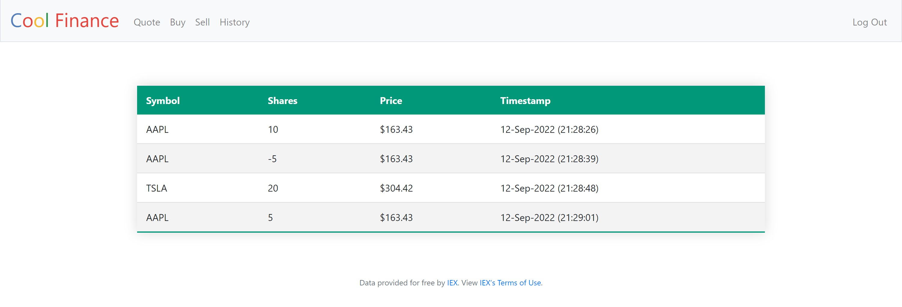

CoolFinance
---

### Summary
Welcome to CoolFinance! A website where you can simulate buying and selling stocks. Uses real-time stock information and saves your personal transaction history. Registering for an account comes with $10,000 virtual money which you can use to quote current stock prices, buy, sell and view transaction history.

### Technical Details
CoolFinance's backend was built using a SQLite database and Python. Flask was used with HTML/CSS to display the frontend.

### Setup
1.	Go to the project directory in the command prompt
2.	Create a virtual environment using `py -m venv env`. (if already exists, go to step 4)
3.	Wait for it to install
4.	Activate the virtual environment using `env\Scripts\activate`
5. Run `pip install -r requirements.txt`
5.	Run `set FLASK_APP=application.py`
6. Run `set API_KEY=<api_key>`. You need the API key from https://iexcloud.io/docs/api/.
7.	To run the file, type `flask run`
8.	To exit the virtual environment, type `deactivate`

### Screenshots
Home page to view the current portfolio:  

Buy page:  

History page to view personal transaction history:  
 
